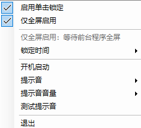

<p align="center">
  
</p>

<h1 align="center">ClickLock Notifier</h1>

<p align="center">
  给 Windows 鼠标单击锁定增加清晰、克制的托盘控制和声音提示。
</p>

<p align="center">
  <a href="README.en.md">English</a>
  ·
  <a href="https://github.com/BeeThor/ClickLockNotifier/releases/latest">下载最新版</a>
</p>

<p align="center">
  
  
  
  
</p>

<p align="center">
  <a href="https://linux.do/">
    
  </a>
</p>

---

ClickLock Notifier 是一个轻量级 Windows 托盘工具，用于给系统“鼠标单击锁定 / Mouse ClickLock”增加清晰的声音提示。

它主要面向《俄罗斯钓鱼 4》（Russian Fishing 4）以及其他需要长按鼠标左键、希望减轻手指负担的场景。程序会在 Windows 单击锁定触发时播放提示音，让你不用靠手感猜测“到底锁住没有”。

## 界面预览

<p align="center">
  
</p>

## 适合谁

- 《俄罗斯钓鱼 4》（Russian Fishing 4）玩家。
- 需要长时间按住鼠标左键的游戏或桌面场景。
- 已经使用 Windows Mouse ClickLock，但希望知道“什么时候真的锁住了”的用户。

## 功能亮点

- 在托盘菜单中直接开启或关闭 Windows 鼠标单击锁定。
- 支持设置单击锁定触发时间。
- 长按左键触发锁定时播放可选择的提示音。
- 再次点击解除锁定时播放固定解除提示音。
- 支持 `0% / 20% / 40% / 60% / 80% / 100%` 音量设置。
- 支持开机启动。
- 支持“仅全屏启用”，避免在桌面、浏览器或普通窗口里误触。
- 使用 Windows Raw Input 监听物理鼠标按下/抬起事件，尽量避免被 ClickLock 改写后的普通鼠标消息影响。
- 托盘图标内置在 exe 中，不依赖外部图标文件。

## 快速下载

前往 [Releases](https://github.com/BeeThor/ClickLockNotifier/releases/latest) 下载：

```text
ClickLockNotifier-win-x64.zip
```

解压后运行：

```text
ClickLockNotifier.exe
```

## 它不做什么

- 不读取游戏内存。
- 不修改游戏内存。
- 不向游戏注入 DLL 或代码。
- 不自动钓鱼、瞄准、移动或做任何游戏决策。
- 不发送网络请求。
- 不是外挂客户端，只是本地 ClickLock 状态提示和 Windows 设置辅助工具。

## 使用方式

程序启动后会出现在 Windows 右下角通知区域。右键托盘图标打开菜单。

菜单项说明：

- `启用单击锁定`：开启或关闭 Windows 鼠标单击锁定。
- `仅全屏启用`：只有当前前台窗口是全屏时才实际开启单击锁定。
- `锁定时间`：选择 Windows 单击锁定触发时间。
- `开机启动`：设置当前用户登录后自动启动。
- `提示音`：选择锁定成功时的提示音。
- `提示音音量`：设置提示音音量。
- `测试提示音`：播放当前选择的锁定提示音。

## 《俄罗斯钓鱼 4》推荐设置

1. 启动 ClickLock Notifier。
2. 勾选 `启用单击锁定`。
3. 建议勾选 `仅全屏启用`，避免离开游戏后误触。
4. 在 `锁定时间` 中选择一个舒服的时间，例如 `800 毫秒` 或 `1000 毫秒`。
5. 选择一个短促的提示音，并调整音量。
6. 游戏中长按左键，听到提示音后说明 ClickLock 已触发。
7. 需要解除时再次点击左键。

## 系统要求

- Windows 10 或 Windows 11
- x64 系统
- 正常使用不需要管理员权限
- 只有从源码构建时才需要 .NET SDK 9.0

Release 中的可执行文件是 self-contained 发布版，普通用户不需要额外安装 .NET。

## 从源码构建

```powershell
dotnet restore ClickLockNotifier.sln
dotnet build ClickLockNotifier.sln
```

生成发布版：

```powershell
.\scripts\publish.ps1
```

输出目录：

```text
dist/win-x64/ClickLockNotifier.exe
```

## 项目结构

```text
ClickLockNotifier/
  ClickLockNotifier.sln
  Directory.Build.props
  scripts/
    publish.ps1
  src/
    ClickLockNotifier/
      Assets/
      *.cs
      ClickLockNotifier.csproj
```

## 安全与游戏规则说明

本项目使用公开的 Windows API：

- `SystemParametersInfo`：读取和设置 Windows 鼠标单击锁定。
- Raw Input：监听物理鼠标按键事件。
- 当前用户 `Run` 注册表项：仅在开启“开机启动”时写入。

虽然本程序不读写游戏内存、不注入进程，也不做自动化游戏行为，但不同游戏或反作弊系统对输入辅助工具可能有自己的规则。使用前请自行确认目标游戏的用户协议和社区规则。

## 第三方资源

声音资源和依赖说明见 [THIRD_PARTY_NOTICES.md](THIRD_PARTY_NOTICES.md)。

## 社区友链

<p align="center">
  <a href="https://linux.do/">
    
  </a>
</p>

- **我的开源项目已链接认可 LINUX DO 社区：** 是
- 社区地址：[https://linux.do/](https://linux.do/)

## 许可证

本项目使用 MIT License 开源，见 [LICENSE](LICENSE)。
